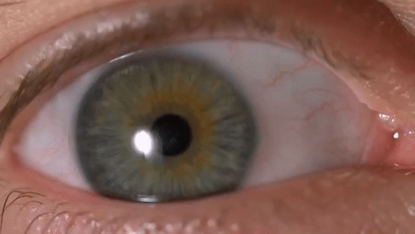
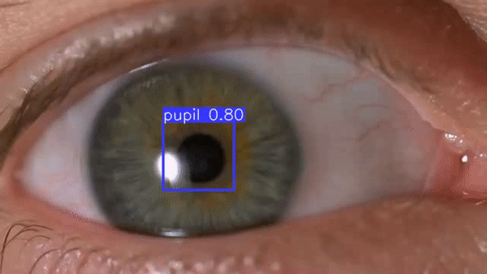

## Pupil_Tracker_with_YOLOv5s

### Description
This repository contains a pupil tracker program implemented using the [YOLOv5s model from ultralytics](https://github.com/ultralytics/yolov5). I designed the program to detect and track pupils in webcam feeds and video frames. I trained The YOLOv5s model on a [ETVR dataset from Roboflow](https://universe.roboflow.com/pupiltracking/etvr).

### Example

| Input | Output |
| ----- | ------ |
|  |  |

### Results on the Validation Data
* Precision: 0.993
* Recall:    0.920
* mAP50:     0.956
* mAP50-95:  0.442

### How to Use

1. Clone the repo:
   ```bash
   git clone https://github.com/denizydmr07/Pupil_Tracker_with_YOLOv5s.git
   cd Pupil_Tracker_with_YOLOv5s
   ```
2. Install the required dependencies:
   ```bash
   pip install -r requirements.txt
   ```
3. Run the program:
   * If you want to use your webcam feed:
     ```bash
     python main.py 0
     ```
   * If you want to use a video:
     ```bash
     python main.py /path-to-your-file
     ```
 
